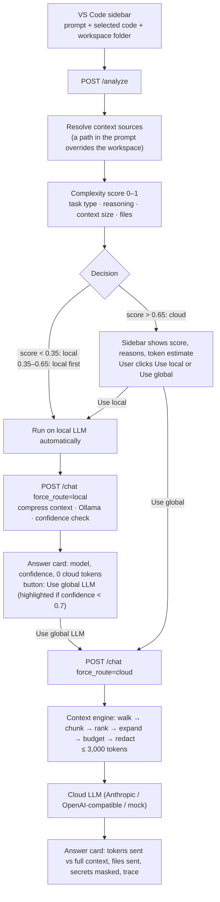

# TokenGuard

> **A local-first AI gateway for coding assistants.**
>
> Simple coding questions are answered by a small model on your machine. Hard ones go to a cloud LLM, with only the relevant, secret-redacted code attached, and only after you agree.

TokenGuard is not another coding LLM. It is the layer in front of the models that decides **where** each question is answered and **how much** of your code travels with it. It ships as a VS Code sidebar ("LocalPilot Assistant") backed by a small Python gateway.

---

## Why

Cloud-only coding assistants send every request, often with a large slice of the repository, to a remote model:

- A one-line regex question is billed like a multi-file refactor.
- A laptop that can run a 7B coding model sits idle while every question goes to the cloud.
- Source code, and the secrets in it, leave the machine by default.

TokenGuard sends each request to the cheapest, most private model that can answer it, and compresses the context before anything leaves the machine.

---

## Process flow



### Step by step

1. **Collect the request (sidebar).** The extension sends the prompt, the current editor selection (`code`) and the folder of the active file (`repo_path`).
2. **Resolve the context sources (gateway).** If the prompt contains an absolute path to an existing folder, that folder becomes the repo to search. If it names a file, the file is attached as code and its project root (nearest `.git`, `package.json`, `pyproject.toml`, …) is searched. The path text is removed from the prompt. Otherwise the workspace folder is used.
3. **Analyze, no model called (`POST /analyze`).** The analyzer scores the task from 0 to 1 and returns the decision, the reasons, the files the context engine would select, and how many tokens the cloud would receive versus the full context.
4. **Decide the route.**
   - `local` (score < 0.35) and `local_first` (0.35–0.65): the sidebar runs the local LLM automatically.
   - `cloud` (score > 0.65): the sidebar waits for the user to click **Use local LLM** or **Use global LLM (recommended)**.
5. **Run the chosen route (`POST /chat` with `force_route`).**
   - **Local:** the context engine builds the context, Ollama answers as JSON `{answer, confidence, needs_cloud}`, and the confidence is adjusted (very short answers and hedges such as "I'm not sure" lower it). Nothing leaves the machine.
   - **Global:** the context engine always runs right before the cloud call: it selects the relevant code, fits it into the token budget and masks secrets in both the code and the prompt. Only that slice is sent.
6. **Show the receipts.** The answer card shows the model, latency, confidence (local) or tokens sent / saved, files sent and secrets masked (global), plus a pipeline trace. A local answer always offers **Use global LLM**; it is highlighted when confidence is below 0.7. The header shows backend and Ollama status and the session's local/cloud counts and tokens saved (`GET /health`, `GET /stats`).

### Routing score

| Factor | Weight | Signal |
|---|---|---|
| Task type | 40% | Keywords: `refactor`, `race condition`, `architecture` (hard) vs `explain`, `rename`, `regex` (easy) |
| Reasoning | 20% | Reasoning markers ("why", "trade-off", "step by step") and prompt length |
| Context size | 20% | Tokens of selected code + repo (8k+ tokens = 1.0) |
| Files | 20% | Files mentioned in the prompt and the size of the attached repo |

A clearly complex task keeps a floor of `0.8 × task_type`, so a hard prompt with no code attached still reaches the strong model. Rules were chosen over a trained classifier so every decision comes with readable reasons. See [`localpilot/ROUTING.md`](localpilot/ROUTING.md) for worked examples.

### Context engine

Deterministic and LLM-free (`localpilot/optimizer/`):

1. **Walk** the repo, respecting `.gitignore` and skipping `node_modules`, build output, minified and binary files.
2. **Chunk** code into functions and classes (80-line windows where there are no symbols).
3. **Rank** chunks with IDF-weighted matches of the query terms in symbol names, paths and bodies. The query is the prompt plus the most frequent identifiers of the selected code, so vague prompts ("explain this") still find related files.
4. **Expand** one hop through the import graph.
5. **Budget:** a short summary of every relevant file first, then full bodies, then extra chunks, never repeating a line, within `CLOUD_CONTEXT_TOKEN_BUDGET` (3,000 tokens by default).
6. **Redact** secrets (AWS keys, OpenAI keys, GitHub tokens, private keys, connection strings, `password = "…"` style assignments).

If the engine fails, the router falls back to a simpler keyword-based optimizer so a request never breaks.

---

## Repository layout

| Path | What |
|---|---|
| `localpilot/app/` | Gateway (FastAPI): `analyzer.py`, `router.py`, `context.py` (path resolution + optimizer adapter), `llm.py` (Ollama + cloud clients), `main.py` (API) |
| `localpilot/optimizer/` | Context engine: walker, chunker, selector, import graph, budget allocator, redaction |
| `localpilot/ui.py` | Optional Streamlit UI with the same flow as the sidebar |
| `tokenguard/` | VS Code extension: the LocalPilot sidebar (`src/extension.ts`) |
| `tests/` | Context engine tests |
| `bench/`, `run_demo.py`, `examples/` | Benchmarks, a CLI demo and a generator for the demo repo |
| `docs/` | Context engine spec, benchmark notes, pipeline trace |

### API

| Endpoint | Purpose |
|---|---|
| `POST /analyze` | `{prompt, code, repo_path}` → decision, score, reasons, repo searched, files selected, token estimate. No model called. |
| `POST /chat` | Same body + `force_route: auto \| local \| cloud` → answer, route, model, confidence, tokens sent/saved, files, secrets masked, trace |
| `GET /stats` | Session totals: local/cloud requests, escalations, tokens saved |
| `GET /health` | Backend status, Ollama reachability, local model, cloud provider |

---

## Getting started

### Prerequisites

- [Ollama](https://ollama.com/) running locally with the local model pulled (default `qwen2.5-coder:7b`, set `LOCAL_MODEL` to change):

  ```bash
  ollama pull qwen2.5-coder:7b
  ```

- Python 3.9+
- VS Code 1.82+, and Node.js 18+ to rebuild the extension (`tokenguard/out/` is committed)
- Optional: an Anthropic or OpenAI-compatible API key. Without one, `CLOUD_PROVIDER=mock` returns a stand-in cloud answer so the whole pipeline still runs.

### 1. Backend (gateway)

```bash
python -m venv localpilot/.venv
source localpilot/.venv/bin/activate
pip install -r requirements.txt

cd localpilot
cp .env.example .env          # set CLOUD_PROVIDER and API keys here
uvicorn app.main:app --reload --port 8000
```

Check it: `curl localhost:8000/health`

### 2. VS Code extension (sidebar)

```bash
cd tokenguard
npm install
npm run compile
```

Open the `tokenguard/` folder in VS Code and press `F5`. In the Extension Development Host window, open the project you want to ask about (or paste a path to it in the prompt), then click the LocalPilot icon in the activity bar.

The backend URL is the `tokenguard.apiUrl` setting (default `http://localhost:8000`).

### Optional

```bash
streamlit run localpilot/ui.py            # browser UI with the same flow
python examples/seed_demo_repo.py         # creates examples/frozen_repo, a small TS repo with an auth module
python run_demo.py                        # context engine CLI demo on that repo
python -m pytest tests                    # context engine tests
```

### Configuration (`localpilot/.env`)

| Variable | Default | Meaning |
|---|---|---|
| `CLOUD_PROVIDER` | `mock` | `anthropic`, `openai` (any OpenAI-compatible API) or `mock` |
| `ANTHROPIC_API_KEY`, `ANTHROPIC_MODEL` | – , `claude-sonnet-5-5` | Anthropic settings |
| `OPENAI_API_KEY`, `OPENAI_BASE_URL`, `OPENAI_MODEL` | – , OpenAI, `gpt-4o-mini` | OpenAI-compatible settings (OpenAI, Groq, OpenRouter, …) |
| `OLLAMA_URL`, `LOCAL_MODEL` | `http://localhost:11434`, `qwen2.5-coder:7b` | Local model |
| `LOCAL_THRESHOLD`, `CLOUD_THRESHOLD` | `0.35`, `0.65` | Routing thresholds |
| `MIN_LOCAL_CONFIDENCE` | `0.7` | Below this, a local answer is flagged for the global LLM |
| `CLOUD_CONTEXT_TOKEN_BUDGET` | `3000` | Max context tokens sent to the cloud |

---

## Measured results

Token counts from our runs (tiktoken `cl100k`). "Full context" is the prompt plus every source file in the repo, which is what a cloud-only assistant could send.

| Prompt | Route | Full context | Sent to cloud | Saved |
|---|---|---:|---:|---:|
| Write a regex to match an email address | Local (`qwen2.5-coder:7b`, 28 s) | 24,812 | 0 | 100% |
| Refactor the auth architecture across the whole codebase | Global | 24,814 | 2,982 | 88% |
| Explain the auth schema (`frozen_repo`) | Global | 2,604 | 502 | 81% |
| Find and fix a race condition in the user service (`frozen_repo`) | Global | 2,610 | 587 | 78% |

The global answers in these runs came from the mock provider; the token savings do not depend on which cloud model answers.

---

## Roadmap

Done: VS Code sidebar, local and cloud LLM clients, rule-based router with user consent, confidence-based escalation, token measurement, context selection and compression, secret redaction, session stats.

Next:

- Response cache (prompt + code hash in SQLite)
- Learn the router from logged decisions and "Use global LLM" retries
- Savings dashboard in the sidebar
- AST-based (Tree-sitter) chunking for more languages

---

## Positioning

**TokenGuard is not a coding LLM. It is the inference layer that decides where your tokens go.**

- Keep simple work on-device
- Escalate only when necessary, and only with the user's consent
- Send only the context that matters
- Keep secrets off the wire
